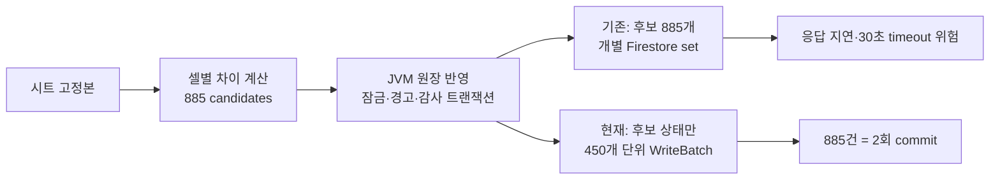

# 캐시플로우 시트 반영 후보 885건과 후처리 성능 기록

- 상태: 적용됨
- 기준 커밋: `cc591324` (2026-07-23, Stage 전용)
- 범위: `cashflow(사용내역 연동)`의 명시적 불러오기 → 반영

## 결론

`885건`은 원장 행 또는 API 호출 수가 아니다. 시트 고정본과 현재 캐시플로우 원장이 다른 **셀 단위 변경 후보** 수다.

당시 화면의 실제 분해는 다음과 같다.

| 구분 | 변경 후보 |
|---|---:|
| Projection | 59건 |
| Actual | 826건 |
| 연간 합계 | 0개년 |
| 합계 | **885건** |

12개월 × 5주차 × 16개 현금흐름 항목 × Projection/Actual 2영역 = 최대 1,920개 월별 셀이다. 그중 시트와 원장이 같거나 둘 다 미입력인 1,035개는 후보에서 제외되고, 다른 885개만 후보가 됐다.

`0`은 명시값이고 빈 셀은 미입력이다. 따라서 Actual 826건에는 신규 값, 기존 시트 출처 Actual의 제거, 명시적 0의 반영이 함께 포함될 수 있다. 다른 출처의 Actual은 유지한다.

## 왜 30초를 넘겼는가

주간 정산 경고를 확인한 뒤의 반영은 JVM 원장 트랜잭션이 성공한 다음, 후보 885개의 상태를 `applied`로 바꾸는 부수 작업을 기다렸다. 기존 BFF는 이 상태 변경을 개별 Firestore `set()` 호출로 실행했다. `Promise.all`은 동시 시작일 뿐, 885개 쓰기를 하나의 Firestore 요청으로 만들지는 않는다.

## 결정

후보 상태 변경만 Firestore `WriteBatch`로 450건씩 커밋한다.

- 885건이면 `ceil(885 / 450) = 2`회 커밋
- JVM의 금액 반영, 주간 정산 잠금 검증, 사후 변경 경고 누적, 감사 로그는 변경하지 않는다.
- `409 cashflow_settled_week_change_confirmation_required`는 오류가 아니라 사용자의 명시적 확인 팝업을 여는 계약으로 유지한다.
- timeout을 늘리거나 409를 200으로 바꾸지 않는다. 둘 다 병목 또는 금융 경고 계약을 숨길 뿐이다.

## 시행착오와 교정

1. 처음에는 409를 성공 응답으로 바꾸는 방안을 검토했다.
   - 교정: 팝업이 정상 동작하는 409 계약을 유지했다. HTTP 상태를 바꾸면 다른 호출자와 오류 처리의 의미가 흐려진다.
2. 30초 timeout을 늘리는 방안은 채택하지 않았다.
   - 교정: 실제로 불필요한 885건 개별 상태 쓰기가 존재했다. 제한 시간을 늘리면 같은 비용을 더 오래 기다릴 뿐이다.
3. 후보 자체를 없애지는 않았다.
   - 교정: 후보는 시트 셀·원장 값·주간 정산 경고를 연결하는 감사 단위다. Finance에서 필요한 원인 추적을 잃게 된다.

## 검증

- `server/bff/routes/cashflow-sheet-lab.test.mjs`: 59개 테스트 통과
- 49개 후보 fixture에서 후보 상태 변경이 49회 개별 쓰기가 아닌 1회 배치 커밋임을 확인
- Stage 배포 성공: GitHub Actions run `29989604490`

## 남긴 경계

이번 변경은 **확인 후 반영**의 병목만 줄인다. 시트 고정 단계에서 후보를 처음 저장하는 작업도 후보별 문서를 만든다. 그 단계가 별도로 느려진다는 측정값이 나오면, 같은 `WriteBatch` 패턴으로 바꾸되 후보 문서의 셀 단위 감사 계약은 유지한다.

관련 코드:

- `server/bff/routes/cashflow-sheet-lab.mjs` — 후보 생성·반영 상태 변경
- `server/jvm-weekly-api/.../FirestoreInheritedWeeklyExpensePersistence.java` — 금융 원장·주간 정산 잠금의 권위 있는 트랜잭션
