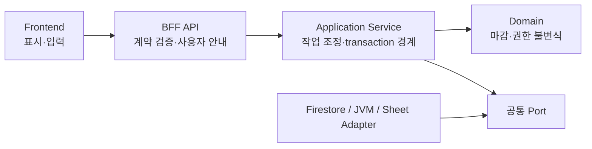

# 현금흐름 기간 권한·마감 모니터·전사 편차 Sprint Contract

**날짜:** 2026-08-14  
**상태:** APPROVED

## 구현 범위

- 기존 시트 반영/freeze 경로를 변경하지 않고 실제 전체연도 fixture로 characterization test를 추가한다.
- 시트가 제공하는 기간 grain만 사용한다. 현재 확인된 구조는 `2024·2025 연간`, `2026 주차`, 이후 실제 존재하는 연간 열이며 `2023` 기간은 만들지 않는다.
- 금액·수식·Projection·Actual·Projection–Actual 값은 Google Sheet snapshot을 SSOT로 유지한다. 프론트와 새 권한 로직은 금액을 재계산하지 않는다.
- 월결산 쓰기 잠금 기준을 canonical cumulative close head의 `closedThrough`로 단일화한다. `monthly_closes`는 실행 이력으로 보존하고 권한 판정에 다시 사용하지 않는다.
- 기존 v2 head의 `fromMonth=2023-01`은 immutable manifest hash 범위를 설명하는 legacy provenance일 뿐이다. 유효 월별 authority grain은 시트가 선언한 `2026` 주차 연도이며, `2024·2025` 연간형을 월별 CLOSED로 해석하거나 2023 기간·금액을 생성하지 않는다.
- 기간 권한, 마감 실행 상태, 수정 허용(amendment), 감사 로그를 분리한다. 월결산 잠금은 해당 현금흐름 월 범위까지만 적용하며 이후 주차·다른 업무를 잠그지 않는다.
- 닫힌 범위 수정은 일반 사용자를 차단하고, 조직장은 자기 조직 범위만, 슈퍼관리자는 전사 reopen/복구와 권한 위임을 수행한다. 모든 변경은 People UID, 사유, 대상 범위, 이전/이후 상태, source revision과 함께 append-only 기록한다.
- `mwbyun1220@mysc.co.kr`은 최초 bootstrap에서만 People UID로 해석한다. 런타임 권한 판정에는 이메일을 사용하지 않는다.
- `AXR > 현금흐름 기간·마감 정책`은 정책/권한, 월결산 상태·오류, 수정·재오픈 감사 로그, 시트 grain/source revision QA를 서버 read model 그대로 표시한다.
- 실험적 전사 편차는 W주 Actual과 `실무자의 W-1 주정산 완료 시점`에 저장된 W주 Projection snapshot을 비교한다. 유효 baseline이 없는 프로젝트는 0으로 간주하지 않고 coverage 부족으로 표시하며, 기능 활성화 이후 데이터만 누적한다.

## 계층·API 경계

- 의존성은 `UI → API → Application → Domain` 단방향이다. Domain은 Application, HTTP DTO, Firestore/JVM/Sheet 구현을 알지 않는다.
- Domain은 기간 잠금, 지정 승인자, 상태 전이와 같은 순수 비즈니스 판정만 담당한다. Application Service는 Domain 판정과 transaction, idempotency, audit, 외부 Port 호출을 조정한다.
- 외부 애플리케이션은 Application이 유지하는 공통 Port를 통해서만 연결한다. 같은 동작은 BFF와 JVM에서 동일한 operation id, 상태 전이, error code를 사용한다.
- 조회 부가 기능의 실패는 해당 section만 `PARTIAL/UNAVAILABLE`로 표시하고 다른 조회를 유지한다. 금액 결측을 0이나 정상으로 바꾸지 않는다.
- 권한·마감·revision을 확인할 수 없는 쓰기는 해당 mutation만 fail-closed한다. 다른 프로젝트·기간·조회·알림까지 함께 중단하지 않는다.
- UI에는 기술 예외 문자열을 그대로 노출하지 않는다. API의 안정된 error code를 한국어 행동 가이드와 `retry/wait/contact`로 변환한다.
- 이번 스프린트는 기존 JVM 전체를 재계층화하지 않는다. 변경한 기간 authority/reopen/variance 경로에서 새 역방향 의존성이나 구현체 직접 참조가 생기지 않는 것을 배포 기준으로 삼는다.

## 성공 기준

- 실제 fixture에서 2023 기간을 생성하지 않고 annual/weekly grain과 셀 좌표를 기존 parser와 동일하게 인식한다.
- 기존 sheet stage/apply/readback 결과와 저장 문서 구조가 characterization test 전후 동일하다.
- `settlementMonth`가 닫혀 있어도 `closedThrough` 이후 월의 주차 쓰기는 허용되고, `closedThrough` 이하는 명시적 amendment 없이는 차단된다.
- 변경한 JVM canonical mutation guard는 `monthly_closes` 상태만으로 쓰기를 막지 않는다. 기존 frozen Sheet preflight는 최신 승인에 따라 byte-identical로 유지하고, AXR 복구가 head/current-header를 정상 상태로 수렴시켜 같은 loop에 재진입시킨다.
- close/reopen/amendment/role grant 변경은 권한 판정과 audit write가 하나의 서버 transaction에서 처리된다.
- 조직장은 자기 조직 범위만, 슈퍼관리자는 전사 범위만 허용되며 일반 담당자와 프론트 우회 호출은 403/409로 차단된다.
- AXR 화면은 policy, authority, run/error, amendment, audit, sheet revision을 서로 다른 상태로 보여주며 불가용 데이터를 0 또는 정상으로 숨기지 않는다.
- 편차 read model은 sheet snapshot provenance를 포함하고 `baseline coverage < 100%`를 명시한다.
- 프론트에는 금액 합산, `Projection - Actual`, 누적, 기간 추론, 권한 추론이 추가되지 않는다.
- 기존 현금흐름 조회·시트 반영·주간 정산·월결산 회귀 테스트, BFF/JVM 테스트, 타입검사와 production build가 통과한다.
- 운영 배포는 clean한 GitHub `main` 병합 커밋과 자동 배포만 사용하고, 배포 후 AXR 화면·권한 차단·기존 freeze 경로를 canary 검증한다.
- canonical cumulative close head가 누락되었거나 손상되어도, exact `ACTIVE` runtime admin은 AXR 화면에서 명시적 사유·idempotency·expected evidence를 제출해 ERP 내부 복구를 완료할 수 있다. 런타임 이메일만으로는 복구 권한을 얻지 못한다.
- 복구 command는 transaction 안에서 head를 제외한 immutable month close/version/request 근거로 candidate를 다시 계산한다. 근거가 완전한 누락 head는 생성하고, 충돌 head는 exact overwrite하며, 변경 전·후 전체 값을 같은 transaction의 append-only audit에 보존한다.
- canonical candidate와 정확히 일치하는 정상 head는 덮어쓰지 않고 정상 reopen으로 안내한다. immutable evidence가 불완전해 exact repair가 불가능하면 AXR 화면에서 손상 authority와 exact mutable current header의 full before를 감사 격리하고, immutable request/version/Sheet를 보존한 채 기존 정상 월결산 경로에 재진입할 수 있다. current header가 이미 없어도 exact immutable settlementMonth로 손상 authority만 제거한다.
- request/version의 최신 settlementMonth가 다르면 서버가 opaque cycle evidence 후보를 제공하고 ACTIVE runtime admin이 실제 회차를 선택한다. UI는 period/doc ID를 조합하지 않으며, transaction은 선택 evidence와 원본 fingerprint를 다시 검증한다. 서버 근거에서 회차를 하나도 식별할 수 없으면 값을 추측하지 않고 write 0건으로 차단한다.
- 같은 recovery evidence의 재요청은 head와 audit를 중복 생성하지 않는다. reset 뒤 head/current header가 모두 없으면 `RECLOSE_READY`이며, lost response 뒤 새 idempotency key로 다시 요청해도 semantic replay로 확인만 하고 audit/write를 추가하지 않는다. 한 프로젝트의 복구 불가·evidence drift는 다른 프로젝트의 정책 조회를 중단시키지 않는다.
- 복구 API의 unknown adapter/영문 기술 메시지는 UI에 노출하지 않고, 403/409/5xx를 고정 한국어 권한 확인·재조회·잠시 후 재시도/AXR 문의 가이드로 표시한다.

## 실패 기준 (하나라도 발생하면 배포 중단)

아래 항목은 구현 목표가 아니라, 사보타주·회귀 테스트로 발생하지 않음을 증명해야 하는 실패 조건이다.

- 시트에 없는 2023 또는 가짜 주차를 생성한다.
- 프론트나 DB 원본이 시트 금액보다 우선한다.
- 기존 freeze/apply 함수의 입력·출력·쓰기 순서 또는 문서 경로를 바꾼다.
- 한 조직/기간의 오류가 다른 조직의 authority를 변경하거나 전사 처리를 중단한다.
- Domain이 Application/API/Adapter를 참조하거나, UI가 권한·기간·금액을 다시 판정한다.
- 외부 조회 하나의 실패가 독립 section까지 실패시키거나, 기술 예외 문구가 사용자 화면에 그대로 노출된다.
- 권한 판정 실패·시트 snapshot 누락·revision 불일치를 fail-open 처리한다.
- 슈퍼관리자가 사유/audit 없이 잠금을 우회하거나 마지막 활성 슈퍼관리자를 제거할 수 있다.
- 과거 편차를 현재 Projection으로 재구성하거나 결측 프로젝트를 0원으로 합산한다.
- dirty worktree의 기존 사용자/Claude 변경을 덮어쓰거나 함께 커밋한다.

## 범위 밖

- `PERMANENTLY_CLOSED/SEALED` 같은 복구 불가 상태
- 2023 기간·금액 backfill
- 과거 편차의 추정 재구성
- Google Sheet 양식·16개 항목·formula 좌표 변경
- 기존 freeze/apply pipeline 리팩터링
- frozen Sheet parser → 검증본 stage → apply → JVM 반영 loop의 함수, 파일, call/write order 변경
- 전사 ERP 권한 체계 전체 개편
- 알림·Slack을 authority transaction의 성공 조건으로 만드는 변경

## 평가 방법

- 실제 fixture 기반 parser/snapshot golden test와 기존 sheet apply 테스트를 먼저 통과시킨다.
- BFF/JVM의 `closedThrough` 경계, 조직 범위 권한, amendment/reopen idempotency, audit 원자성을 서버 테스트로 검증한다.
- AXR UI는 server fixture 응답만으로 render하는 component/shell test를 실행하고 계산 helper가 새로 생기지 않았는지 정적 검색한다.
- 별도 QA가 정상·loading·empty·unavailable·revision mismatch·권한 없음·중복 요청·부분 coverage를 검사한다.
- 배포 전 변경 파일을 기존 dirty diff와 분리해 리뷰하고, `main` CI와 production canary 증거를 남긴다.
