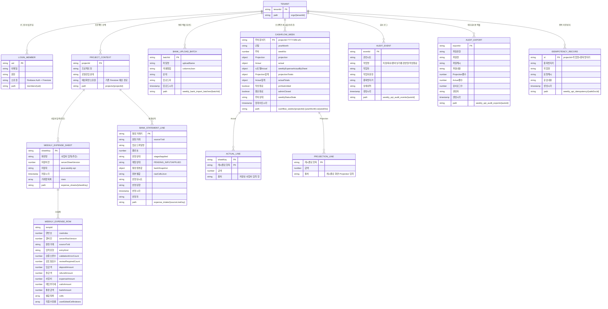
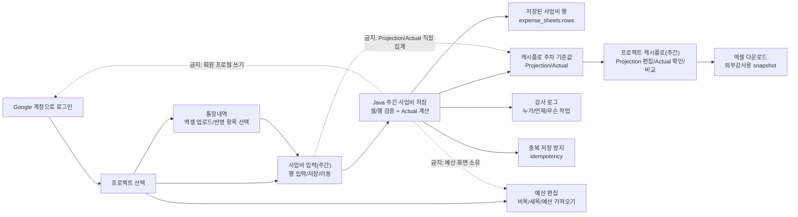

# 주간 사업비/캐시플로 Firestore 구조

이 문서는 `understand-anything` 그래프와 Java 저장소 코드 `FirestoreInheritedWeeklyExpensePersistence`를 대조해서 정리한 현재 DB 구조다. 운영/PO가 읽을 수 있도록 화면 용어를 먼저 쓰고, 개발자 확인용 컬렉션/필드명은 뒤에 붙였다.

정책 경계:

- 로그인과 포털 진입은 `Google 계정으로 로그인`, `프로젝트 선택` 흐름이다. Java가 회원 프로필을 쓰지 않는다.
- `예산 편집`, `예산 가져오기`, `비목/세목` 관리는 기존 예산 Firestore 경로가 담당한다.
- `사업비 입력(주간)` 화면은 행 입력, 저장, 통장내역 이동, 캐시플로 이동만 담당한다.
- `프로젝트 캐시플로(주간)` 화면만 Projection/Actual 조회, 비교, 엑셀 다운로드를 담당한다.
- Java는 주간 사업비 저장, 행/셀 검증, Actual 계산, 캐시플로 read model, 외부감사용 export snapshot, idempotency만 담당한다.

## 화면 용어 대조표

| 화면에서 보이는 말 | 코드/DB에서의 의미 | 실제 저장 위치 |
| --- | --- | --- |
| 사업비 입력(주간) | 주간 사업비 시트, 행/셀 command | `projects/{projectId}/expense_sheets/{sheetKey}` |
| 거래/행 | 사업비 입력 한 줄 | `expense_sheets/{sheetKey}.rows[]` |
| 통장내역 | 엑셀 업로드 후 반영 후보 | `projects/{projectId}/expense_intake/{sourceLineKey}` |
| 기존 통장내역 가져오기 | 통장내역 기준본에서 사업비 행으로 반영 | `expense_intake` + `expense_sheets.rows[]` |
| 캐시플로 보기 | 캐시플로 화면 이동 | `/portal/cashflow` |
| 프로젝트 캐시플로(주간) | Projection/Actual 주차별 비교 화면 | `cashflow_weeks/{projectId-YYYY-MM-wN}` |
| Projection | 계획값, 캐시플로 화면에서만 편집 | `cashflow_weeks.projection` |
| Actual | 저장된 사업비 행으로 Java가 계산한 기준값 | `cashflow_weeks.actual` |
| 입금/출금 | 캐시플로 라인 묶음 | `projection`, `actual`, `projectionTotals`, `actualTotals` |
| 주차 작성완료/결산완료 | PM 제출, 관리자 마감 상태 | `cashflow_weeks.pmSubmitted`, `adminClosed`, `weeklyStatusState` |
| 엑셀 다운로드/외부감사용 | Projection + Actual + audit summary snapshot | `weekly_api_audit_exports` |
| 예산 편집 | 예산 UI 기존 경로 | Java weekly API 소유 아님 |
| 비목/세목 | 예산/사업비 분류명 | Java는 주간 사업비 검증에만 사용 |

## 캐시플로 항목명

| 화면 묶음 | 화면/업무 용어 | 내부 코드 |
| --- | --- | --- |
| 입금 | MYSC 선급금 입금 | `MYSC_PREPAY_IN` |
| 입금 | 매출 입금 | `SALES_IN` |
| 입금 | 매출 부가세 입금 | `SALES_VAT_IN` |
| 입금 | 팀 지원금 입금 | `TEAM_SUPPORT_IN` |
| 입금 | 은행 이자 입금 | `BANK_INTEREST_IN` |
| 출금 | 사업비 | `DIRECT_COST_OUT` |
| 출금 | 매입부가세 | `INPUT_VAT_OUT` |
| 출금 | MYSC 인건비 | `MYSC_LABOR_OUT` |
| 출금 | MYSC 이익 | `MYSC_PROFIT_OUT` |
| 출금 | 매출 부가세 출금 | `SALES_VAT_OUT` |
| 출금 | 팀 지원금 출금 | `TEAM_SUPPORT_OUT` |
| 출금 | 은행 이자 출금 | `BANK_INTEREST_OUT` |

## Stage 저장 검증

2026-06-10 stage smoke에서 Java가 실제로 쓴 경로:

- `orgs/stage-smoke/projects/stage-verify-codex20260610105103/expense_sheets/default`
- `orgs/stage-smoke/cashflow_weeks/stage-verify-codex20260610105103-2026-06-w1`
- `orgs/stage-smoke/weekly_api_audit_events/*`
- `orgs/stage-smoke/weekly_api_audit_exports/*`
- `orgs/stage-smoke/weekly_api_idempotency/*`
