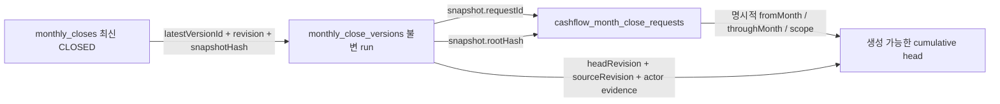

# Cashflow cumulative close head 감사·복구 Runbook

## 목적과 경계

`monthly_closes`가 `CLOSED` 또는 `REOPEN_REQUESTED`인데
`cashflow_cumulative_close_heads/{projectId}`가 없으면, canonical write guard는 그 상태를
정상 `OPEN`으로 추정하지 않고 `cashflow_month_close_migration_required`로 차단한다.

이 도구는 두 가지 일만 한다.

1. non-`OPEN` monthly run과 cumulative authority head의 불일치를 read-only로 감사한다.
2. 이미 저장된 불변 근거가 완전한 프로젝트에 한해서만 authority head를 transaction으로 생성하거나 exact 복구한다.

다음은 범위 밖이다.

- 시트 stage/apply, mirror, 좌표 계약 코드 변경
- JVM 월·주간 결산 코드 변경
- 시트 셀, Firestore 금액, 월 합계의 계산·보정·추론
- 기존 `monthly_closes.snapshot`, `snapshotHash`, CLOSED 판정값 수정
- `UNREPAIRABLE` 근거에서 가짜 `OPEN` header, 금액, `closedThrough`를 생성

## 기본 안전장치

```text
기본 실행       read-only dry-run
write 전환      --apply 필수
write 범위      --allow-projects의 구체적인 project ID만 허용 (* 금지, 최대 50개)
행위자           People UID 1건 + ACTIVE member 연결 필수
사유             --reason 필수
저장 방식        하나의 Firestore transaction
감사             같은 transaction의 append-only audit chain
재실행           같은 head면 no-op replay, 다른 head면 conflict
```

운영 apply 전에는 Firestore 사본/백업을 먼저 확인한다. 이 저장소의 운영 배포·작업 정책에 따라
운영 자격증명이나 API key를 코드에 넣지 않고, 승인된 환경변수/secret만 사용한다.

## READY 판정 근거

자동 backfill은 최신 non-`OPEN` monthly run이 `CLOSED`이고 아래 연결이 전부 성립할 때만 가능하다.



구체적인 필수 근거:

- monthly close와 immutable version의 tenant/project/yearMonth/status/revision/snapshotHash 일치
- version snapshot의 cumulative contract, request ID/revision, root hash, head revision 존재
- request와 nested `scope`의 `fromMonth`가 JVM canonical baseline `2023-01`로 명시되고,
  명시적 `throughMonth`가 존재
- `throughMonth`의 다음 달이 settlement `yearMonth`와 일치
- request manifest hash와 snapshot root/manifest hash 일치
- immutable version의 `sourceRevision` 존재
- manifest month hash 목록이 명시적 from/through 범위와 연속·동일하고 `monthCount`와 일치
- approval/operation ID, closedAt, closedByUid가 request/run/current close에서 일치

어느 하나라도 빠지거나 서로 다르면 기간이나 금액을 만들어 채우지 않고
`UNREPAIRABLE`과 원인 코드를 출력한다. `REOPEN_REQUESTED` run 역시 자동 생성하지 않는다.

## 실행

### 1. Dry-run (항상 먼저)

```bash
node scripts/audit-cashflow-month-close-state.mjs \
  --firebase-project <firebase-project-id> \
  --tenant <tenant-id>
```

`실행 모드: DRY_RUN`, `Firestore write 0건`을 확인한다.

주요 결과:

| 상태 | 의미 | 자동 write |
|---|---|---:|
| `AUTHORITY_PRESENT` | immutable run 근거와 기존 head가 일치 | 없음 |
| `READY` | head는 없고 근거는 완전함 | allowlist apply 가능 |
| `REPAIR_READY` | immutable 근거는 완전하지만 기존 head가 canonical candidate와 충돌 | allowlist exact repair 가능 |
| `UNREPAIRABLE` | 근거 누락, reopening 중, 중복 run 등으로 candidate를 확정할 수 없음 | 금지 |

### 2. 승인된 프로젝트만 Apply

```bash
node scripts/audit-cashflow-month-close-state.mjs \
  --firebase-project <firebase-project-id> \
  --tenant <tenant-id> \
  --apply \
  --allow-projects <project-a,project-b> \
  --people-uid <operator-people-uid> \
  --reason "<승인된 복구 사유>"
```

allowlist의 프로젝트 중 하나라도 `READY`, `REPAIR_READY` 또는 exact `AUTHORITY_PRESENT`가 아니면 transaction을
시작하기 전에 전체 실행을 거절한다. transaction이 시작된 뒤 audit append가 실패하거나 기존 head가
달라졌다면 head 생성도 함께 롤백된다.

apply transaction은 dry-run 때 읽은 계획만 신뢰하지 않는다. 같은 transaction 안에서 monthly close,
immutable version, request, 현재 head를 모두 다시 읽어 revision/hash/actor evidence가 계획과 동일한지
검증한다. 사이에 근거가 바뀌었으면 전체 apply를 중단한다.

### 3. 같은 명령 재실행

첫 실행이 성공한 뒤 같은 명령을 재실행하면 head의 canonical 필드를 비교한다.

- 동일: `idempotent replay`, 추가 audit 없음
- dry-run의 current-head fingerprint와 다름: evidence drift, 기존 head 보존, write 없음

## 생성 문서와 감사 근거

head는 JVM이 정상 cumulative close에서 쓰는 필드만 immutable 근거에서 복사한다.
`fromMonth`도 요청값을 임의로 복사하지 않고, 요청·scope가 JVM baseline `2023-01`과 일치하는지
검증한 뒤 동일한 값으로만 생성한다.

```text
orgs/{tenantId}/cashflow_cumulative_close_heads/{projectId}
```

별도의 migration 추정값이나 현재 시각을 head에 넣지 않는다. 감사 로그에는 아래를 append-only로 남긴다.

- `actorId`: 명시한 People UID
- `action`: 신규는 `CASHFLOW_CUMULATIVE_CLOSE_HEAD_BACKFILLED`, exact repair는 `CASHFLOW_CUMULATIVE_CLOSE_HEAD_REPAIRED`
- `reason`
- `before`: 신규는 `{ exists: false }`, repair는 손상된 기존 head 전체
- `after`: 생성한 head 전체
- `sourceRevision`
- monthly close/current version/request 경로와 각 revision/snapshot hash

## AXR ERP 복구와 `UNREPAIRABLE` 처리

`AXR > 현금흐름 기간·마감 정책`은 같은 application planner/executor를 사용한다. exact `ACTIVE`
runtime admin만 서버가 발급한 expected evidence, 명시적 사유, idempotency key로 실행할 수 있다.
이메일·legacy role·inactive member·viewer는 권한 근거가 아니다. 정상 head는 복구 버튼 대신 canonical
reopen 경로를 안내하고, 복구 성공 후 정책 snapshot을 다시 읽는다.

`UNREPAIRABLE`은 오류를 숨긴 fallback이 아니라 운영 검토 큐다. 다음을 하지 않는다.

- settlement month에서 `throughMonth`를 역산
- shard 마지막 원소만 보고 누락된 scope를 생성
- Projection/Actual 합계나 sheet cell을 다시 계산해 root hash를 생성
- 기존 snapshot/hash/status 재작성

대신 AXR 화면은 exact current cycle을 서버에서 확정할 수 있을 때 `격리 후 재결산 준비`를 제공한다.
회차는 우선 exact `monthly_closes/{projectId}-{YYYY-MM}` ID, 그 문서가 이미 없으면 exact immutable
request/version의 최신 `yearMonth`, 마지막으로 tenant/project가 일치하고 형식이 유효한 기존
`head.settlementMonth`만 사용한다. request와 version의 최신 회차가 다르면 서버가 두 opaque evidence
후보를 반환하고 관리자가 화면에서 실제 재결산 회차를 명시적으로 선택한다. 프론트는 ID나 기간을
계산하지 않는다.

실행 transaction은 head, 선택한 exact current header, immutable request/version을 다시 읽는다.
canonical head가 정상이면 normal reopen을 요구하고, immutable evidence로 exact repair가 가능하면
repair를 우선한다. 자동 repair가 불가능한 경우에만 손상 head와 선택한 mutable current header의 전체
before 값을 append-only audit에 보존한 뒤 해당 authority/header 문서만 제거한다. header가 이미 없으면
`exists:false`를 감사하고 손상 head만 제거한다. immutable request/version과 Sheet snapshot은 삭제·수정하지
않는다. 이후 문서 부재라는 기존 OPEN 초기 상태로 돌아가 frozen Sheet 검증본 stage → apply → JVM → 정상
월결산 경로를 그대로 재사용한다.

head와 mutable current header가 이미 모두 없으면 기존 writable 초기 상태이므로 다시 reset하거나 감사 로그를
추가하지 않는다. read model은 `RECLOSE_READY`를 반환하고, lost response 뒤 새 idempotency key로 같은 근거를
재제출해도 immutable evidence와 회차가 일치하는지만 확인한 `RESET_TO_RECLOSE_REPLAYED`로 응답한다.

서버 근거에서 회차 후보를 하나도 확인할 수 없으면 임의 YYYY-MM을 만들지 않는다. 이 경우에는 사용자가
선택한 회차를 별도 prepare command가 Firestore fingerprint와 결합해 opaque evidence로 발급하는 seam이
추가되기 전까지 write를 차단한다. CLI/DB 수동 수선이나 가짜 OPEN fallback으로 우회하지 않는다.

## 검증

```bash
npx vitest run server/bff/cashflow-cumulative-close-head-migration.test.mjs
node scripts/audit-cashflow-month-close-state.mjs --help
```

회귀 테스트는 dry-run 무쓰기, apply flag/allowlist/People UID/reason gate, 불완전 근거 차단,
JVM baseline 불일치 차단, reopening 차단, 완전 근거의 충돌 head exact repair, transaction 직전 source/head
drift 차단, atomic audit 실패 롤백, 정상 head 미덮어쓰기, 성공 후 idempotent replay를 고정한다. 또한
invalid head + header absent, 여러 immutable 회차의 서버 후보 선택, mutable header만 제거하고 immutable
evidence는 보존하는 reset-to-reclose, reset 뒤 기존 month writable guard 재진입, lost response/new-key
재시도에서 중복 감사·삭제 0건을 고정한다.

## Frozen loop 비변경 증명

이 복구는 period authority BFF/application/AXR UI 바깥으로 확장하지 않는다. 특히 Sheet parser → 검증본
stage → apply → JVM 반영 loop와 call/write order는 변경하지 않는다. 배포 전 해당 frozen 파일을
`origin/main`과 byte 단위로 비교하고 diff가 0인지 확인한다.

이 구현 작업에서는 실제 운영 Firebase를 조회하거나 apply하지 않는다.
