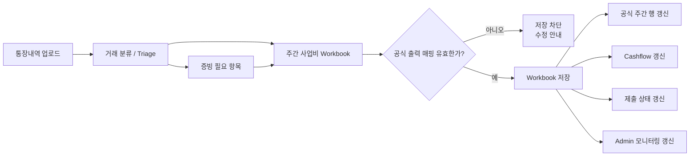

# Embedded Workbook Engine Development Plan

> **For agentic workers:** REQUIRED SUB-SKILL: Use superpowers:subagent-driven-development (recommended) or superpowers:executing-plans to implement this plan task-by-task. Steps use checkbox (`- [ ]`) syntax for tracking.

**Goal:** Keep the existing `통장내역 → triage → 주간입력 → cashflow / 제출 / admin` flow alive while upgrading `사업비 입력(주간)` into the first project-scoped authoritative workbook surface.

**Architecture:** The plan keeps `Vite React` as the editing surface and grows the existing `Rust` calculation core into a workbook validation/runtime layer. The workbook is not a separate product. It becomes the project’s official calculation document inside InnerPlatform, while bank intake, evidence, cashflow, submission, and admin monitoring continue to hang off the same project state.

**Tech Stack:** Vite React 18, TypeScript, Vitest, Playwright, Express BFF, Firestore, Rust (`spreadsheet-calculation-core`), WASM/native dual-run, Husky hooks

---

## 문서 목적

이 문서는 기존 spec과 execution map을 바탕으로 만든 **비개발자도 읽을 수 있는 개발 계획서**다.

이 문서가 답하는 질문은 아래 다섯 가지다.

- 왜 이 작업이 필요한가
- 무엇을 먼저 만들고 무엇을 나중에 미루는가
- 기존 운영 흐름 중 절대 깨지면 안 되는 것은 무엇인가
- 어떤 이슈 묶음으로 실행할 것인가
- 어느 시점에 “이제 전환해도 된다”라고 판단할 것인가

## 한 줄 요약

우리는 새로운 시트 제품을 따로 만드는 것이 아니라, **현재 InnerPlatform 안의 주간 사업비 화면을 프로젝트별 공식 workbook으로 승격**하려고 한다.

다만 이 전환은 기존 운영 흐름을 버리는 방식이 아니라, 아래 흐름을 유지한 채 workbook 권위층을 끼워 넣는 방식으로 간다.

- 통장내역 업로드
- triage / 검토
- 주간 사업비 입력
- 증빙 / 제출
- cashflow / admin 모니터링

## Product Flow Chart

## Rollout Flow Chart

## 절대 고정할 원칙

아래 항목은 개발 중 흔들리면 안 된다.

- `통장내역 → triage → 주간입력` ingress는 유지한다.
- 코어 정책 셀은 값/수식 수정만 가능하고, **추가/삭제는 불가**하다.
- 공식 출력 매핑이 깨지면 저장을 막는다.
- workbook 저장 결과는 cashflow, 제출, admin 모니터링까지 같은 프로젝트 기준으로 반영되어야 한다.
- 같은 프로젝트 안의 여러 시트 참조는 허용하지만, 다른 프로젝트 참조는 하지 않는다.
- 첫 대상은 `사업비 입력(주간)` 하나다. 예산과 캐시플로 전체 전환은 후속 단계다.

## 이번 계획에서 다루는 이슈 트랙

### Track 1. PM이 주간 사업비를 공식 시트처럼 운영할 수 있게 만들기

왜 필요한가:
현재 화면은 입력은 가능하지만 운영 기준을 PM이 직접 조정하는 느낌은 약하다.

이번 트랙의 결과:
- 주간 사업비가 프로젝트용 workbook shell을 가진다.
- `사업비 입력`, `통장내역 보기`, `정책`, `출력 매핑`, `요약` 구조가 보인다.
- 기존 데이터를 열면 workbook 기본 구조로 바로 들어온다.

주요 개발 영역:
- `src/app/platform/project-workbook.ts`
- `src/app/platform/project-workbook-legacy-adapter.ts`
- `src/app/components/workbook/*`
- `src/app/components/portal/PortalWeeklyExpensePage.tsx`

### Track 2. 기존 통장내역/증빙 흐름을 끊지 않고 workbook으로 연결하기

왜 필요한가:
새 시트가 들어와도 기존 운영팀은 여전히 통장내역과 증빙 기준으로 일한다.

이번 트랙의 결과:
- triage wizard가 그대로 살아 있다.
- intake queue와 증빙 대기 상태가 workbook 옆에서도 계속 보인다.
- 기존 운영팀이 “화면은 바뀌었지만 처리 순서는 그대로”라고 설명할 수 있다.

주요 개발 영역:
- `src/app/platform/bank-intake-surface.ts`
- `src/app/data/portal-store.tsx`
- `src/app/components/portal/PortalWeeklyExpensePage.tsx`

### Track 3. 정책 셀과 공식 출력 매핑을 안전하게 관리하기

왜 필요한가:
PM이 자율성을 가져야 하지만, 운영 기준까지 무너지면 안 된다.

이번 트랙의 결과:
- 정책 셀은 수정 가능하지만 추가/삭제는 막힌다.
- 공식 출력 매핑이 빠지면 저장이 막힌다.
- “어디까지 바꿀 수 있는지”가 화면과 정책 문서에 함께 남는다.

주요 개발 영역:
- `src/app/platform/workbook-output-mapping.ts`
- `src/app/components/workbook/WorkbookPolicyPanel.tsx`
- `src/app/components/workbook/WorkbookOutputMappingPanel.tsx`
- `rust/spreadsheet-calculation-core/src/workbook_mapping.rs`

### Track 4. workbook 저장 결과를 cashflow / 제출 / admin 기준으로 연결하기

왜 필요한가:
새 시트가 공식 기준이라면 저장 결과가 다른 화면에도 즉시 반영되어야 한다.

이번 트랙의 결과:
- workbook 저장 후 cashflow가 같은 기준으로 업데이트된다.
- 제출 준비 상태가 다시 계산된다.
- admin 모니터링도 동일한 프로젝트 기준을 읽는다.

주요 개발 영역:
- `src/app/platform/cashflow-sheet.ts`
- `src/app/platform/settlement-calculation-kernel.ts`
- `server/bff/project-workbooks.mjs`
- `src/app/lib/platform-bff-client.ts`

### Track 5. 여러 명이 함께 수정해도 안전하게 저장되게 만들기

왜 필요한가:
PM, 사업담당자, 재경이 시간차를 두고 같은 프로젝트를 수정할 수 있다.

이번 트랙의 결과:
- 오래된 버전에서 저장하면 충돌로 처리된다.
- 어떤 셀이 다르게 바뀌었는지 보여준다.
- 정책 변경은 `forward_only`와 `recalc_all` 중 하나를 선택할 수 있다.

주요 개발 영역:
- `src/app/platform/workbook-conflicts.ts`
- `src/app/platform/workbook-replay.ts`
- `src/app/components/workbook/WorkbookConflictDialog.tsx`
- `rust/spreadsheet-calculation-core/src/workbook_replay.rs`

### Track 6. 단계적으로 켜고 기존 결과와 계속 비교하기

왜 필요한가:
한 번에 뒤집으면 어떤 층에서 계산이 어긋나는지 찾기 어렵다.

이번 트랙의 결과:
- feature flag로 workbook 노출 여부를 제어할 수 있다.
- shadow mode에서 기존 결과와 workbook 결과를 비교할 수 있다.
- 브라우저 계산과 서버 계산이 같은지 계속 점검한다.

주요 개발 영역:
- `src/app/config/feature-flags.ts`
- `src/app/platform/settlement-rust-kernel.test.ts`
- `server/bff/settlement-kernel.mjs`
- `docs/wiki/patch-notes/*`

## 개발 단계

### Phase 0. 토대 고정

목적:
정책 문서, 경계, issue track, feature flag 전략을 먼저 고정한다.

핵심 작업:
- workbook 정책 기록 문서 추가
- commit light hook 추가
- feature flag 설계 고정
- workbook 문서 구조와 Firestore 저장 위치 고정

완료 기준:
- 정책 셀 불변 규칙이 문서화되어 있다.
- 개발자가 workbook 관련 커밋 시 `WB-*` 정책 참조를 남길 수 있다.
- `workbooks/default`, `workbook_outputs/current` 경로가 계획 상 기준으로 고정된다.

### Phase 1. workbook 모델과 주간 사업비 연결

목적:
현재 주간 사업비 데이터를 workbook 형식으로 읽고, workbook shell을 마운트할 준비를 한다.

핵심 작업:
- `ProjectWorkbook` 타입 추가
- legacy expense rows → workbook adapter 추가
- portal store에서 workbook hydration 경로 추가
- workbook shell 기본 UI 추가

완료 기준:
- 현재 주간 사업비 데이터를 workbook 형식으로 만들 수 있다.
- 아직 기본 화면은 바꾸지 않더라도 workbook이 내부적으로 준비된다.

### Phase 2. 저장 규칙과 계산 경계 만들기

목적:
“이 시트는 저장해도 되는가”를 브라우저와 서버가 같은 기준으로 판단하게 한다.

핵심 작업:
- Rust workbook schema 추가
- output mapping validation 추가
- save blocking contract 추가
- BFF save/load route 추가

완료 기준:
- 공식 출력 매핑 누락 시 저장이 차단된다.
- 브라우저와 서버가 같은 validation error shape를 사용한다.
- workbook 저장 응답이 version conflict를 표현할 수 있다.

### Phase 3. workbook을 weekly expense 화면에 opt-in으로 붙이기

목적:
기존 운영 흐름을 유지한 채 workbook을 화면에 올린다.

핵심 작업:
- `VITE_WEEKLY_EXPENSE_WORKBOOK_ENABLED` 추가
- workbook shell을 flag 뒤에 마운트
- triage / 증빙 / 드라이브 관련 UI를 그대로 유지
- flow-layout 회귀 테스트 유지

완료 기준:
- flag가 꺼져 있으면 기존 화면이 그대로 보인다.
- flag가 켜져 있으면 workbook shell이 weekly expense surface에 나타난다.
- 기존 triage 및 evidence 액션이 사라지지 않는다.

### Phase 4. workbook을 공식 상태로 fan-out하기

목적:
workbook 저장이 프로젝트의 공식 운영 상태가 되게 만든다.

핵심 작업:
- official weekly rows 생성
- cashflow line item fan-out
- submission readiness fan-out
- admin snapshot fan-out

완료 기준:
- workbook 저장 후 cashflow가 갱신된다.
- workbook 저장 후 제출 상태가 다시 계산된다.
- workbook 저장 후 admin 모니터링도 같은 기준을 읽는다.

### Phase 5. 충돌 처리, 재계산 모드, parity 검증

목적:
실제 운영 환경에서 여러 사람이 수정해도 안전하게 유지되게 한다.

핵심 작업:
- optimistic versioning
- cell-level conflict diff
- `forward_only` / `recalc_all` replay helper
- Rust parity tests 확장

완료 기준:
- 오래된 버전에서 저장 시 충돌 응답을 반환한다.
- 사용자에게 어떤 셀이 다른지 보여줄 수 있다.
- 정책 변경 시 적용 범위를 선택할 수 있다.

### Phase 6. 점진 rollout과 운영 문서 마무리

목적:
새 workbook을 비교, 검증, 설명 가능한 상태로 전환한다.

핵심 작업:
- shadow mode 결과 비교
- opt-in rollout
- default-on 전환 기준 정리
- README / patch notes / wiki 반영

완료 기준:
- 운영팀이 rollout 순서를 문서만 보고 설명할 수 있다.
- patch note에 workbook 전환 이유와 영향 범위가 남아 있다.
- legacy cleanup은 별도 계획으로 분리되어 있다.

## 주요 검증 기준

아래 검증 스위트는 마지막까지 계속 녹색을 유지해야 한다.

- Store / persistence
  - `src/app/data/portal-store.intake.test.ts`
  - `src/app/data/portal-store.integration.test.ts`
  - `src/app/data/portal-store.persistence.test.ts`
  - `src/app/data/portal-store.settlement.test.ts`
- Weekly expense flow
  - `src/app/components/portal/PortalWeeklyExpensePage.flow-layout.test.ts`
  - `src/app/platform/bank-intake-surface.test.ts`
  - `src/app/platform/weekly-expense-save-policy.test.ts`
  - `src/app/platform/portal-happy-path.test.ts`
- Kernel parity
  - `src/app/platform/settlement-calculation-kernel.test.ts`
  - `src/app/platform/settlement-rust-kernel.test.ts`
  - `src/app/platform/settlement-kernel-contract.test.ts`
- BFF
  - `server/bff/app.test.ts`
  - `server/bff/app.integration.test.ts`
  - `server/bff/routes/projects.test.ts`
  - `server/bff/project-sheet-source-storage.test.ts`

권장 확인 명령:

- `npx vitest run`
- `npm run rust:settlement:test`
- `npm run bff:test:integration`
- `npx playwright test tests/e2e/bank-upload-triage-wizard.spec.ts tests/e2e/settlement-product-completeness.spec.ts --config playwright.harness.config.mjs`
- `npm run build`

## 주요 리스크와 대응

리스크 1. workbook이 들어오면서 통장내역 ingress가 흐려질 수 있다.

대응:
- triage wizard 제거를 금지한다.
- workbook은 ingress replacement가 아니라 authoritative layer라고 계속 문서화한다.

리스크 2. PM 자율성을 주다가 운영 기준이 무너질 수 있다.

대응:
- 보호된 정책 셀은 존재 자체를 고정한다.
- 공식 출력 매핑이 깨지면 저장을 막는다.

리스크 3. 브라우저 계산과 서버 계산 결과가 달라질 수 있다.

대응:
- TS/Rust contract를 따로 둔다.
- parity test를 rollout 종료 조건에 포함한다.

리스크 4. 한번에 전환하면 어디서 틀어졌는지 찾기 어렵다.

대응:
- shadow → opt-in → default-on 순서를 강제한다.
- cleanup은 후속 계획으로 분리한다.

## 이번 계획에서 하지 않는 것

- 범용 스프레드시트 제품 만들기
- 자유로운 행/열 추가
- 다른 프로젝트를 참조하는 수식
- 첫 배포 시 전 사용자 강제 전환
- legacy 코드 즉시 삭제

## 마일스톤별 성공 기준

이 계획은 마지막 한 번의 “완료”로 관리하면 안 된다.  
각 Phase가 끝날 때마다 **다음 단계로 넘어가도 되는지**를 따로 판단해야 한다.

아래 기준은 PM 기준의 Go/No-Go gate다.

### Milestone 0. 방향과 보호 규칙 고정

이 마일스톤의 질문:
“팀이 같은 제품을 만들고 있는가?”

성공 기준:
- [ ] workbook 전환의 목표가 `사업비 입력(주간)` 1차 전환으로 고정되어 있다.
- [ ] 기존 `통장내역 → triage → 주간입력` 흐름을 유지한다는 원칙이 문서에 명시되어 있다.
- [ ] 정책 셀은 수정 가능하지만 추가/삭제 불가라는 규칙이 문서와 이슈에 박혀 있다.
- [ ] feature flag 기반 rollout 순서가 정의되어 있다.
- [ ] 이 작업을 관리할 이슈 트랙이 분리되어 있다.

증빙 자료:
- 개발 계획서
- execution map
- policy record
- GitHub issue set

Go/No-Go:
- 이 기준이 없으면 구현 착수 금지

### Milestone 1. 내부 workbook 토대 완성

이 마일스톤의 질문:
“지금 데이터를 workbook이라는 새 틀로 안전하게 읽을 수 있는가?”

성공 기준:
- [ ] 현재 주간 사업비 데이터를 workbook 구조로 변환할 수 있다.
- [ ] 프로젝트별 기본 workbook skeleton이 일관되게 생성된다.
- [ ] 아직 화면을 바꾸지 않아도 내부적으로 workbook state를 만들 수 있다.
- [ ] 기존 주간 사업비 저장/조회 흐름에 회귀가 없다.

증빙 자료:
- `ProjectWorkbook` 타입/테스트
- legacy adapter 테스트
- portal-store integration/persistence 테스트

Go/No-Go:
- 기존 데이터가 workbook으로 안정적으로 읽히지 않으면 UI 전환 금지

### Milestone 2. 저장 차단 규칙 완성

이 마일스톤의 질문:
“잘못된 workbook이 공식 상태로 들어가는 것을 시스템이 막을 수 있는가?”

성공 기준:
- [ ] 보호된 정책 셀을 삭제하려는 시도를 막을 수 있다.
- [ ] 공식 출력 매핑이 깨진 workbook은 저장이 차단된다.
- [ ] 브라우저와 서버가 같은 validation 결과를 사용한다.
- [ ] workbook 저장 경로와 version conflict 응답 형식이 정해져 있다.

증빙 자료:
- Rust workbook schema / validation 테스트
- TS/Rust contract 테스트
- BFF save/load 테스트

Go/No-Go:
- 잘못된 workbook 저장을 막지 못하면 workbook을 사용자에게 노출 금지

### Milestone 3. Opt-in 화면 전환 성공

이 마일스톤의 질문:
“새 workbook 화면을 켜도 기존 운영 플로우가 안 깨지는가?”

성공 기준:
- [ ] feature flag가 꺼져 있으면 기존 화면이 그대로 보인다.
- [ ] feature flag가 켜져 있으면 workbook shell이 weekly expense 화면에 나타난다.
- [ ] bank triage wizard 버튼과 intake queue가 그대로 보인다.
- [ ] 증빙 업로드/드라이브 연결 흐름이 그대로 보인다.
- [ ] 운영팀이 “화면은 달라졌지만 처리 순서는 그대로”라고 설명할 수 있다.

증빙 자료:
- flow-layout 테스트
- bank intake surface 테스트
- weekly expense smoke / e2e 확인

Go/No-Go:
- triage나 증빙 흐름이 사라지면 rollout 중단

### Milestone 4. workbook이 공식 운영 기준이 됨

이 마일스톤의 질문:
“이제 workbook 저장 결과를 프로젝트의 공식 상태라고 불러도 되는가?”

성공 기준:
- [ ] workbook 저장 후 공식 주간 행이 다시 계산된다.
- [ ] workbook 저장 후 cashflow 값이 같은 프로젝트 기준으로 갱신된다.
- [ ] workbook 저장 후 제출 준비 상태가 다시 계산된다.
- [ ] workbook 저장 후 admin 모니터링도 같은 기준을 읽는다.
- [ ] PM이 바꾼 정책/수식이 실제 운영 결과에 반영된다.

증빙 자료:
- workbook output mapping 테스트
- cashflow / settlement kernel 테스트
- BFF fan-out 테스트
- 샘플 프로젝트 비교 스크린샷 또는 QA 기록

Go/No-Go:
- weekly/cashflow/submission/admin 중 하나라도 다른 기준을 읽으면 default-on 전환 금지

### Milestone 5. 여러 명이 함께 써도 안전함

이 마일스톤의 질문:
“같은 프로젝트를 여러 명이 수정해도 운영 사고 없이 쓸 수 있는가?”

성공 기준:
- [ ] 오래된 화면에서 저장하면 version conflict로 처리된다.
- [ ] 어떤 셀이 충돌했는지 사용자에게 보여줄 수 있다.
- [ ] 정책 변경 시 `forward_only`와 `recalc_all`을 선택할 수 있다.
- [ ] 브라우저 계산과 서버 계산이 parity 기준을 통과한다.

증빙 자료:
- workbook conflict 테스트
- workbook replay 테스트
- Rust parity 테스트

Go/No-Go:
- 충돌 감지가 안 되거나 parity가 흔들리면 다수 사용자 rollout 금지

### Milestone 6. 단계적 rollout 준비 완료

이 마일스톤의 질문:
“이제 제한된 범위에서 켜고 운영 문서로 설명할 수 있는가?”

성공 기준:
- [ ] shadow mode에서 기존 결과와 workbook 결과 비교 기록이 있다.
- [ ] opt-in rollout 기준이 문서로 정리되어 있다.
- [ ] default-on 전환 조건이 문서화되어 있다.
- [ ] README, wiki, patch note가 함께 갱신되어 있다.
- [ ] legacy cleanup이 별도 후속 계획으로 분리되어 있다.

증빙 자료:
- patch note
- rollout 문서
- QA 비교 기록
- README / 운영 문서

Go/No-Go:
- 운영팀이 문서만 보고 rollout 순서를 설명할 수 없으면 기본값 전환 금지

## 최종 Release Gate

아래 여덟 가지가 모두 맞아야 “1차 전환 성공”으로 본다.

- [ ] PM이 주간 사업비를 프로젝트용 공식 시트처럼 운영할 수 있다.
- [ ] 기존 통장내역/triage/증빙 흐름이 유지된다.
- [ ] 정책 셀은 수정 가능하지만 추가/삭제는 불가능하다.
- [ ] 공식 출력이 깨지면 저장이 차단된다.
- [ ] workbook 저장 결과가 cashflow / 제출 / admin까지 이어진다.
- [ ] 여러 명이 수정해도 충돌을 식별할 수 있다.
- [ ] feature flag 기반으로 단계적 rollout이 가능하다.
- [ ] 운영 문서와 patch note가 함께 갱신된다.
