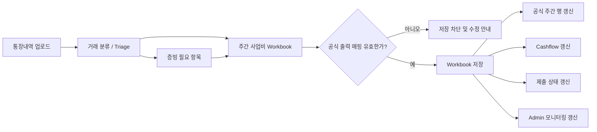

# InnerPlatform Embedded Workbook Engine Umbrella Roadmap

작성일: 2026-04-15

## Executive Summary

이번 전환의 목표는 새로운 시트 제품을 따로 만드는 것이 아니다.

우리가 실제로 만들고 싶은 것은 `사업비 입력(주간)`을 **프로젝트별 공식 workbook surface**로 승격하는 것이다.  
즉, PM과 사업담당자가 개발자 도움 없이도 정책 셀, 수식, 공식 출력 매핑을 관리할 수 있어야 하고, 그 결과가 실제 `cashflow`, `제출`, `admin monitoring`까지 이어져야 한다.

다만 이 전환은 기존 운영 흐름을 뒤엎는 방식으로 가면 안 된다.  
반드시 아래 흐름을 유지한 채 workbook을 authoritative layer로 끼워 넣는다.

- 통장내역 업로드
- triage / 검토
- 주간 사업비 입력
- 증빙 / 제출
- cashflow / admin 모니터링

## 비개발자용 한 문장 설명

쉽게 말하면, 지금까지는 개발자가 많이 도와줘야 바꿀 수 있었던 `주간 사업비 운영 기준`을 앞으로는 PM/사업담당자가 **프로젝트 안의 공식 시트 화면**에서 직접 관리할 수 있게 만들겠다는 계획이다.

다만 아무 셀이나 마음대로 바꾸게 두는 것이 아니라,

- 바꿔도 되는 정책 영역은 넓히고
- 시스템이 꼭 알아야 하는 기준은 보호하고
- 잘못된 변경은 저장 단계에서 막고
- 그 결과를 cashflow / 제출 / admin까지 같은 기준으로 이어지게 하는 것

이 핵심이다.

## 용어 풀이

비개발자 기준으로 자주 나오는 말을 먼저 풀어쓴다.

- `workbook`
  - 프로젝트별 공식 운영 시트 문서다.
  - 단순한 엑셀 파일이 아니라, 시스템이 공식 계산 기준으로 읽는 문서다.
- `workbook surface`
  - 사용자가 실제로 보게 되는 시트형 화면을 뜻한다.
  - 이번에는 `사업비 입력(주간)`이 첫 대상이다.
- `정책 셀`
  - 합계 계산 방식, 분류 기준, 제출 준비 조건처럼 운영 규칙을 담는 셀이다.
  - 값이나 수식은 바꿀 수 있지만, 보호된 셀 자체를 없애거나 새로 만들 수는 없다.
- `공식 출력`
  - workbook 저장 결과를 시스템이 공식적으로 읽는 값이다.
  - 예: 주간 사업비 행, cashflow 금액, 제출 준비 상태, admin 모니터링 상태
- `triage`
  - 통장내역이 들어온 뒤, 어떤 거래를 어떻게 분류하고 확인할지 정리하는 검토 단계다.
- `feature flag`
  - 같은 기능이라도 일부 사용자나 일부 상황에서만 먼저 켜볼 수 있게 하는 안전장치다.
- `shadow mode`
  - 사용자는 아직 기존 화면을 보지만, 내부에서는 새 workbook 결과를 같이 계산해서 비교만 하는 단계다.
- `opt-in`
  - 원할 때만 새 workbook 화면을 켜서 써보는 단계다.
- `default-on`
  - 새 workbook 화면이 기본값이 되는 단계다.
- `parity`
  - 브라우저에서 계산한 결과와 서버에서 계산한 결과가 같은지를 뜻한다.

## 이번 로드맵에서 절대 흔들리면 안 되는 원칙

- `통장내역 -> triage -> 주간입력` ingress는 유지한다.
- 코어 정책 셀은 값/수식 수정만 가능하고 추가/삭제는 불가하다.
- 공식 출력 매핑이 깨지면 저장을 막는다.
- workbook 저장 결과는 cashflow, 제출, admin 모니터링까지 같은 프로젝트 기준으로 반영되어야 한다.
- 같은 프로젝트 안의 여러 시트 참조는 허용하지만, 다른 프로젝트 참조는 하지 않는다.
- 첫 대상은 `사업비 입력(주간)` 하나다. 예산과 캐시플로 전체 전환은 후속 단계다.

## 전체 기간

- 시작: 2026-04-15
- 1차 전환 목표: 2026-05-02

## Product Flow Chart

쉽게 읽으면 아래 뜻이다.

- 통장내역이 먼저 들어온다.
- 사람이 검토하고 분류한다.
- 그 결과가 workbook 화면으로 이어진다.
- workbook에서 저장을 누르기 전에 “이 결과를 시스템이 공식 값으로 써도 되는지”를 검사한다.
- 통과한 경우에만 cashflow / 제출 / admin까지 같은 기준으로 업데이트된다.
- 통과하지 못하면 저장 자체를 막고, 무엇을 고쳐야 하는지 먼저 보여준다.

## Rollout Flow Chart

쉽게 읽으면 아래 뜻이다.

- 처음부터 전 사용자에게 새 화면을 강제로 주지 않는다.
- 먼저 내부 비교만 해보고
- 그 다음 일부에서만 켜보고
- 마지막에 기본값으로 바꾼다.
- 예전 구조를 지우는 일은 맨 마지막 별도 단계다.

## Umbrella 이슈와 하위 실행 이슈

- Umbrella: `#142 [Feature] PM 주간 사업비를 세일즈포스형 운영 콘솔로 고도화`
- Child:
  - `#192` PM이 주간 사업비 화면을 프로젝트용 공식 시트처럼 직접 운영할 수 있게 만들기
  - `#198` 정책 셀은 수정 가능하되 추가/삭제는 막고, 공식 출력이 깨지면 저장을 차단하기
  - `#199` 기존 통장내역/triage/증빙 흐름을 끊지 않고 workbook으로 연결하기
  - `#196` workbook 저장 결과를 cashflow / 제출 / admin 모니터링까지 공식 기준으로 연결하기
  - `#197` 여러 명이 함께 수정해도 충돌을 식별하고 적용 범위를 고를 수 있게 만들기
  - `#195` feature flag 기반으로 workbook을 단계적으로 rollout하고 기존 결과와 계속 비교하기

비개발자 기준으로 보면 이 여섯 개는 아래처럼 이해하면 된다.

- `#192`
  - 새 시트형 화면의 뼈대를 만드는 일
- `#198`
  - 어디까지 바꿀 수 있고, 어디서 저장을 막아야 하는지 정하는 일
- `#199`
  - 기존 통장내역/증빙 흐름이 안 끊기게 붙이는 일
- `#196`
  - 저장 결과를 cashflow / 제출 / admin까지 연결하는 일
- `#197`
  - 여러 명이 동시에 만져도 안전하게 만드는 일
- `#195`
  - 기능을 단계적으로 켜고 비교 검증하는 일

## 마일스톤 운영 방식

- Umbrella `#142`는 방향, 범위, release gate를 관리한다.
- 실제 개발 진행은 child issue 기준으로 추적한다.
- 각 milestone은 **Go / No-Go gate**를 통과해야 다음 단계로 넘어간다.
- milestone을 건너뛰는 rollout은 금지한다.

## Milestone 0. 방향과 보호 규칙 고정

**기간**
- 2026-04-15 ~ 2026-04-15

**Owner**
- `merryAI-dev`

**상태**
- 착수 기준 완료

**목표**
- 팀이 같은 제품을 만들고 있는지 먼저 고정한다.

**쉽게 말하면**
- 아직 코드를 많이 쓰기 전에 “우리가 정확히 뭘 만들고, 무엇은 절대 건드리면 안 되는지”를 먼저 잠그는 단계다.

**완료 기준**
- workbook 전환의 목표가 `사업비 입력(주간)` 1차 전환으로 고정되어 있다.
- 기존 `통장내역 -> triage -> 주간입력` 흐름을 유지한다는 원칙이 문서에 명시되어 있다.
- 정책 셀은 수정 가능하지만 추가/삭제 불가라는 규칙이 문서와 이슈에 박혀 있다.
- feature flag 기반 rollout 순서가 정의되어 있다.
- 이 작업을 관리할 issue track이 분리되어 있다.

**Go / No-Go Gate**
- 위 다섯 가지가 없으면 구현 착수 금지

**이 단계가 끝나면 현업에서 체감하는 변화**
- 아직 화면이 바뀌지는 않는다.
- 대신 앞으로 무엇이 바뀌고 무엇은 안 바뀌는지가 명확해진다.

**이 단계에서 아직 기대하면 안 되는 것**
- 실제 시트형 화면
- 저장 차단 기능
- cashflow 자동 연동

## Milestone 1. Foundation and Shell

**기간**
- 2026-04-15 ~ 2026-04-18

**관련 이슈**
- `#192`

**Priority / Label**
- `priority:P0`
- `area:workbook`

**Assignee**
- `merryAI-dev`

**목표**
- 현재 주간 사업비 데이터를 workbook이라는 새 틀로 안전하게 읽을 수 있게 만든다.

**쉽게 말하면**
- 기존 데이터를 새 시트형 구조로 옮겨 담을 수 있는지 확인하는 단계다.
- “새 화면의 그릇”을 먼저 만드는 작업이라고 보면 된다.

**완료 기준**
- PM이 주간 사업비를 기존 입력표가 아니라 시트형 화면으로 볼 수 있는 기반이 생긴다.
- 화면 안에 최소한 `사업비 입력`, `통장내역 보기`, `정책`, `출력 매핑`, `요약` 구조가 보인다.
- 현재 프로젝트 데이터가 열리면 기본 시트 구조가 자동으로 채워진다.
- 기존 운영팀이 "이제 이 화면이 프로젝트 공식 입력 기준이다"라고 설명할 수 있다.

**Go / No-Go Gate**
- 현재 주간 사업비 데이터를 workbook 구조로 안정적으로 변환할 수 있다.
- 기본 workbook skeleton이 프로젝트 단위로 일관되게 생성된다.
- 기존 주간 사업비 저장/조회 흐름 회귀가 없다.
- 이 기준이 안 되면 UI 전환 단계로 넘어가지 않는다.

**이 단계가 끝나면 현업에서 체감하는 변화**
- 개발팀 입장에서는 새 화면의 바탕 구조가 준비된다.
- PM 입장에서는 아직 큰 변화가 없을 수 있다.

**이 단계에서 아직 기대하면 안 되는 것**
- 정책 셀 직접 수정
- 공식 저장 차단
- cashflow / 제출 / admin 동시 반영

## Milestone 2. Validation and Save Gate

**기간**
- 2026-04-17 ~ 2026-04-21

**관련 이슈**
- `#198`

**Priority / Label**
- `priority:P0`
- `area:workbook`

**Assignee**
- `merryAI-dev`

**목표**
- 잘못된 workbook이 공식 상태로 들어가는 것을 시스템이 막게 만든다.

**쉽게 말하면**
- “어디까지는 자유롭게 바꿀 수 있고, 어디부터는 시스템이 멈춰 세워야 하는가”를 실제 동작으로 만드는 단계다.

**완료 기준**
- 보호된 정책 셀은 수정은 가능하지만 추가/삭제는 불가능하다.
- 시스템이 꼭 알아야 하는 공식 출력 슬롯이 무엇인지 화면에서 확인할 수 있다.
- 공식 출력 매핑이 빠지거나 잘못되면 저장 버튼이 막힌다.
- 운영팀이 "어디를 바꿀 수 있고 어디는 못 바꾸는지"를 쉽게 설명할 수 있다.

**Go / No-Go Gate**
- 보호된 정책 셀 삭제 시도가 validation 단계에서 차단된다.
- 공식 출력 매핑 누락 시 브라우저와 서버 모두 저장을 막는다.
- workbook save route가 version conflict와 validation error를 구분해 응답한다.
- 이 기준이 안 되면 사용자 노출을 시작하지 않는다.

**이 단계가 끝나면 현업에서 체감하는 변화**
- 잘못 바꾼 규칙이 공식 결과로 들어가는 위험이 줄어든다.
- “왜 저장이 안 되는지”를 설명할 근거가 생긴다.

**이 단계에서 아직 기대하면 안 되는 것**
- 새 workbook 화면을 모두에게 공개하는 것
- cashflow / 제출 / admin 즉시 연동 완료

## Milestone 3. Weekly Expense Opt-in

**기간**
- 2026-04-20 ~ 2026-04-24

**관련 이슈**
- `#199`

**Priority / Label**
- `priority:P1`
- `area:workbook`

**Assignee**
- `merryAI-dev`

**목표**
- workbook shell을 feature flag 뒤에 weekly expense 화면에 올리되, 기존 운영 흐름은 그대로 둔다.

**쉽게 말하면**
- 드디어 새 시트형 화면을 weekly expense에 얹어보는 단계다.
- 하지만 기존 통장내역, triage, 증빙 흐름은 그대로 살아 있어야 한다.

**완료 기준**
- 통장내역 업로드와 triage wizard가 계속 동작한다.
- workbook 화면에서도 미분류/검토/증빙 대기 건을 계속 볼 수 있다.
- 증빙 업로드와 드라이브 provision 흐름이 끊기지 않는다.
- 운영팀이 "새 화면으로 바뀌었지만 기존 처리 순서는 그대로다"라고 말할 수 있다.

**Go / No-Go Gate**
- feature flag가 꺼져 있을 때 기존 weekly expense 화면이 그대로 보인다.
- feature flag가 켜져 있을 때 workbook shell이 weekly expense 화면에 나타난다.
- bank triage wizard, intake queue, evidence CTA가 모두 남아 있다.
- 위 셋 중 하나라도 빠지면 rollout을 진행하지 않는다.

**이 단계가 끝나면 현업에서 체감하는 변화**
- 일부 사용자나 특정 환경에서는 새 workbook 화면을 실제로 볼 수 있다.
- 그래도 기존 처리 순서는 바뀌지 않는다.

**이 단계에서 아직 기대하면 안 되는 것**
- 모든 프로젝트에서 기본값 전환
- workbook 저장 결과가 이미 모든 downstream을 바꾸는 것

## Milestone 4. Official Output Fan-out

**기간**
- 2026-04-23 ~ 2026-04-28

**관련 이슈**
- `#196`

**Priority / Label**
- `priority:P1`
- `area:workbook`

**Assignee**
- `merryAI-dev`

**목표**
- workbook 저장 결과를 프로젝트의 공식 운영 상태로 쓴다.

**쉽게 말하면**
- “새 시트는 보기만 좋은 화면”이 아니라, 실제 시스템 기준을 바꾸는 공식 입력면이 되는 단계다.

**완료 기준**
- workbook 저장 후 cashflow 반영 결과가 같은 프로젝트 기준으로 갱신된다.
- workbook 저장 후 제출 준비 상태가 다시 계산된다.
- workbook 저장 후 admin 모니터링에서도 같은 프로젝트 상태를 읽는다.
- 운영팀이 "공식 기준은 workbook 저장 결과"라고 한 문장으로 설명할 수 있다.

**Go / No-Go Gate**
- workbook 저장 후 공식 주간 행이 다시 계산된다.
- workbook 저장 후 cashflow가 같은 프로젝트 기준으로 갱신된다.
- workbook 저장 후 submission readiness가 다시 계산된다.
- weekly / cashflow / submission / admin 중 하나라도 다른 기준을 읽으면 default-on 전환을 하지 않는다.

**이 단계가 끝나면 현업에서 체감하는 변화**
- PM이 workbook에서 바꾼 결과가 cashflow / 제출 / admin에도 실제로 반영된다.
- “공식 기준이 어디냐”는 질문에 workbook이라고 답할 수 있다.

**이 단계에서 아직 기대하면 안 되는 것**
- 여러 명이 동시에 수정해도 완벽히 안전한 상태
- 전체 rollout 완료

## Milestone 5. Conflict and Parity

**기간**
- 2026-04-27 ~ 2026-04-30

**관련 이슈**
- `#197`

**Priority / Label**
- `priority:P2`
- `area:workbook`

**Assignee**
- `merryAI-dev`

**목표**
- 여러 사람이 같은 프로젝트를 수정해도 운영 사고 없이 쓸 수 있게 만든다.

**쉽게 말하면**
- PM, 사업담당자, 재경이 시간차를 두고 같은 프로젝트를 만져도 누가 덮어썼는지 모르는 사고를 줄이는 단계다.

**완료 기준**
- 오래된 화면에서 저장하면 충돌로 인식한다.
- 충돌 시 셀 단위로 차이를 보여줄 수 있다.
- 정책 변경 시 적용 범위를 선택할 수 있다.
- 운영팀이 "여러 명이 만져도 왜 안전한지"를 설명할 수 있다.

**Go / No-Go Gate**
- 오래된 버전 저장 시 version conflict 응답이 반환된다.
- 어떤 셀이 다른지 사용자에게 보여줄 수 있다.
- `forward_only` / `recalc_all`이 저장 흐름 안에서 선택 가능하다.
- parity 테스트가 흔들리면 다수 사용자 rollout을 하지 않는다.

**이 단계가 끝나면 현업에서 체감하는 변화**
- 여러 명이 수정해도 “왜 저장이 막혔는지”, “무엇이 충돌했는지”를 설명할 수 있다.
- 정책 변경 시 과거 데이터에 미칠 영향도 선택해서 적용할 수 있다.

**이 단계에서 아직 기대하면 안 되는 것**
- Google Docs 같은 실시간 동시 편집
- 모든 운영 리스크가 완전히 사라지는 것

## Milestone 6. Rollout Readiness

**기간**
- 2026-04-23 ~ 2026-05-02

**관련 이슈**
- `#195`

**Priority / Label**
- `priority:P2`
- `area:workbook`

**Assignee**
- `merryAI-dev`

**목표**
- workbook을 shadow -> opt-in -> default-on 순서로 켤 준비를 끝낸다.

**쉽게 말하면**
- 이제 “기술적으로 됐다” 수준이 아니라, 실제 운영에 안전하게 켤 수 있는지 최종 점검하는 단계다.

**완료 기준**
- feature flag로 새 workbook 화면 노출 여부를 제어할 수 있다.
- 기존 결과와 새 workbook 결과를 비교하는 검증 경로가 있다.
- 브라우저/서버 계산 차이가 있는지 테스트로 확인할 수 있다.
- patch note와 운영 문서에 전환 기준이 남아 있다.

**Go / No-Go Gate**
- shadow mode에서 기존 결과와 workbook 결과 비교 기록이 있다.
- opt-in rollout 기준이 문서화되어 있다.
- default-on 전환 조건이 문서화되어 있다.
- 운영팀이 문서만 보고 rollout 순서를 설명할 수 없으면 기본값 전환을 하지 않는다.

**이 단계가 끝나면 현업에서 체감하는 변화**
- 어떤 순서로 새 화면을 켤지, 누구에게 먼저 열지, 언제 기본값으로 바꿀지를 설명할 수 있다.
- 운영 문서와 patch note가 함께 맞춰진다.

**이 단계에서 아직 기대하면 안 되는 것**
- legacy 정리까지 한 번에 끝나는 것
- 후속 예산/캐시플로 전환이 자동으로 따라오는 것

## 최종 Release Gate

아래 여덟 가지가 모두 맞아야 1차 전환 성공으로 본다.

- PM이 주간 사업비를 프로젝트용 공식 시트처럼 운영할 수 있다.
- 기존 통장내역/triage/증빙 흐름이 유지된다.
- 정책 셀은 수정 가능하지만 추가/삭제는 불가능하다.
- 공식 출력이 깨지면 저장이 차단된다.
- workbook 저장 결과가 cashflow / 제출 / admin까지 이어진다.
- 여러 명이 수정해도 충돌을 식별할 수 있다.
- feature flag 기반으로 단계적 rollout이 가능하다.
- 운영 문서와 patch note가 함께 갱신된다.

비개발자 기준으로는 이렇게 이해하면 된다.

- 새 workbook 화면이 실제 운영에 쓸 수 있어야 한다.
- 기존 업무 순서를 망가뜨리면 안 된다.
- 누구나 바꾸면 안 되는 기준은 시스템이 보호해야 한다.
- 바꾼 결과가 다른 화면까지 같은 기준으로 이어져야 한다.
- 여러 사람이 함께 써도 “왜 이런 결과가 나왔는지” 설명 가능해야 한다.
- 운영 문서와 커뮤니케이션까지 같이 끝나야 진짜 전환 완료다.

## PM 체크포인트

- 2026-04-18: workbook skeleton과 shell foundation 리뷰
- 2026-04-21: save blocking / policy cell protection 리뷰
- 2026-04-24: weekly expense opt-in UI 리뷰
- 2026-04-28: cashflow / submission / admin fan-out 리뷰
- 2026-04-30: conflict / replay / parity 리뷰
- 2026-05-02: rollout readiness 및 default-on 판단

## 참고 문서

- 개발 계획서: `docs/superpowers/plans/2026-04-15-embedded-workbook-engine-development-plan.md`
- 상세 실행 맵: `docs/superpowers/plans/2026-04-15-embedded-workbook-engine-execution-map.md`
- 설계 문서: `docs/superpowers/specs/2026-04-15-embedded-workbook-engine-design.md`
