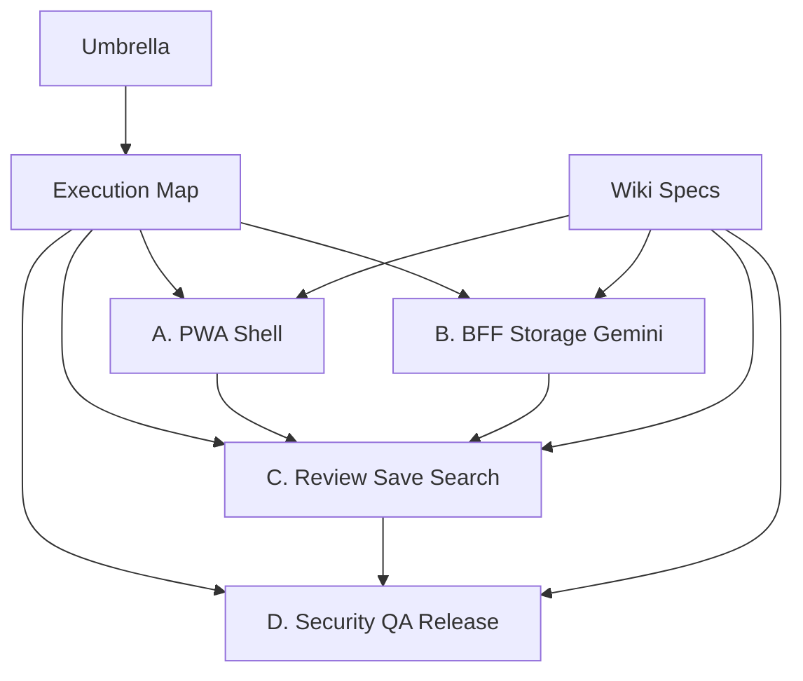

# Business Card DB Implementation Plan

> **For agentic workers:** REQUIRED SUB-SKILL: Use superpowers:subagent-driven-development (recommended) or superpowers:executing-plans to implement this plan task-by-task. Steps use checkbox (`- [ ]`) syntax for tracking.

**Goal:** Add an InnerPlatform LAB business card DB that captures card images, extracts contact fields with Vertex AI Gemini, confirms them through a human review step, and makes contacts org-wide searchable.

**Architecture:** The frontend owns PWA capture and review UX. The BFF owns Storage, Gemini, Firestore, RBAC, and audit. Confirmed contacts are canonical; Gemini drafts are not.

**Tech Stack:** Vite React 18, TypeScript, Express BFF, Firebase Admin/Firestore/Storage, Vertex AI Gemini via `@google/genai`, Vitest, Playwright/manual mobile QA

---

## Executive Summary

명함 DB v1은 리멤버 전체 클론이 아니라 InnerPlatform 내부 관계자 DB의 최소 입력 루프다. 사용자는 모바일에서 명함을 찍고, Gemini가 추출한 값을 확인한 뒤 저장한다. 저장된 연락처는 전사 검색 대상이 되며, 원본 이미지는 private Storage에 계속 보관한다.

## Source Of Truth

- Wiki index: `docs/wiki/business-card-db/index.md`
- Product brief: `docs/wiki/business-card-db/00-product-brief.md`
- Data model: `docs/wiki/business-card-db/01-data-model.md`
- API contract: `docs/wiki/business-card-db/02-api-contract.md`
- Gemini extraction: `docs/wiki/business-card-db/03-vertex-gemini-extraction.md`
- PWA capture: `docs/wiki/business-card-db/04-pwa-mobile-capture.md`
- Security/RBAC: `docs/wiki/business-card-db/05-security-privacy-rbac.md`
- Search/dedupe/quality: `docs/wiki/business-card-db/06-search-dedupe-quality.md`
- Test/QA/release: `docs/wiki/business-card-db/07-test-qa-release.md`
- Execution map: `docs/superpowers/plans/2026-05-23-business-card-db-execution-map.md`

## Dependency Graph

## Workstreams

| Workstream | Primary Owner | Can Start | Depends On | Acceptance |
| --- | --- | --- | --- | --- |
| A. PWA Shell | frontend | immediately | umbrella | LAB route, manifest, mobile capture scaffold |
| B. BFF/Storage/Gemini | backend | immediately | data/API spec | private upload, Gemini draft, integration tests |
| C. Review/Save/Search | full stack | after A+B contracts | A, B | confirm flow and org-wide search |
| D. Security/QA/Release | full stack | after A-C | A, B, C | RBAC/audit/privacy tests and release gate |

## Hard Invariants

- Frontend never calls Gemini or Firebase Storage directly for this feature.
- Gemini output never writes directly to `contacts`.
- `contacts.visibility` defaults to `org`.
- Original image public download URLs are forbidden.
- Auto-merge is forbidden in v1.
- Hermes is excluded from v1.

## Release Gate

- `npm run build` passes.
- Focused Vitest passes for LAB visibility, BFF route behavior, Gemini normalizer, and search scoring.
- Manual QA passes on iPhone Safari and Android Chrome camera/gallery upload.
- Live deploy confirms Vercel alias and private image access behavior.
