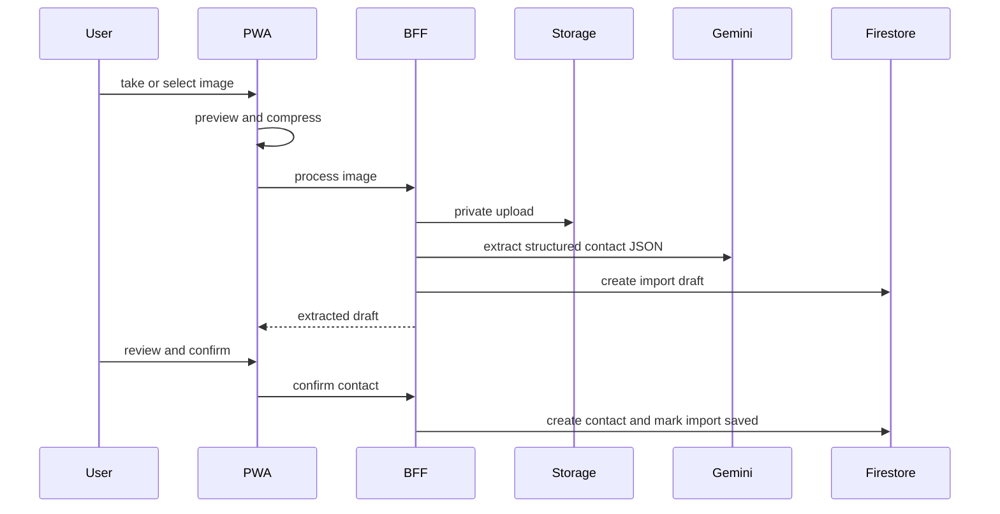

# 04 PWA Mobile Capture

## Routes

```text
/business-cards
/portal/business-cards
```

Both routes point to the same LAB business card workspace with role-aware shell wrapping.

## Capture UI

Use browser-native camera capture first:

```html
<input type="file" accept="image/*" capture="environment">
```

Fallback:

- Gallery upload on unsupported browsers
- Manual entry when upload or Gemini fails

## Flow



## PWA Boundary

- `manifest.webmanifest` provides app name, icons, theme color, and start URL.
- Service worker caches only static shell assets.
- API responses and business card images are not cached.
- Offline capture queue is out of scope for v1.

## Image Compression

Client target:

```text
max_dimension = 1800px
target_bytes <= 3MB
mime = image/jpeg
quality = 0.82 initially, reduce to 0.72 if needed
```

Server hard limit:

```text
fileSize <= 8 * 1024 * 1024
```

## UI States

- `idle`: upload/capture CTA
- `preview`: image preview and submit
- `processing`: server processing
- `needs_review`: extracted fields form
- `saving`: confirm in progress
- `saved`: contact saved and search result link
- `failed`: manual entry and retry option

## Acceptance

- iPhone Safari and Android Chrome can open the camera/gallery picker.
- Upload progress and processing states do not collapse the layout.
- Review form remains usable on mobile width.
- LAB off hides route entry points from nav/command surfaces.
