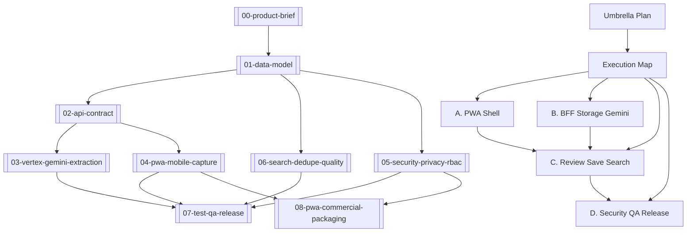

# Business Card DB Wiki

InnerPlatform LAB 안에서 명함을 촬영/업로드하고, Vertex AI Gemini로 연락처 정보를 추출한 뒤, 사람이 검토해 전사 검색 가능한 연락처 DB에 저장하는 기능의 위키다.

## Product One-Liner

현장에서 받은 명함을 잃어버리지 않고, 이름/회사/이메일/전화번호 기준으로 전사에서 다시 찾을 수 있게 한다.

## Source Of Truth

- Product brief: [[00-product-brief]]
- Data model: [[01-data-model]]
- API contract: [[02-api-contract]]
- Gemini extraction: [[03-vertex-gemini-extraction]]
- PWA capture: [[04-pwa-mobile-capture]]
- Security/RBAC: [[05-security-privacy-rbac]]
- Search/dedupe/quality: [[06-search-dedupe-quality]]
- Test/QA/release: [[07-test-qa-release]]
- PWA commercial packaging: [[08-pwa-commercial-packaging]]
- Append-only log: [[log]]

## Implementation Plans

- Design spec: `docs/superpowers/specs/2026-05-23-business-card-db-pwa-vertex-gemini-design.md`
- Umbrella: `docs/superpowers/plans/2026-05-23-business-card-db-umbrella.md`
- Execution map: `docs/superpowers/plans/2026-05-23-business-card-db-execution-map.md`
- A. PWA shell: `docs/superpowers/plans/2026-05-23-business-card-db-a-pwa-shell.md`
- B. BFF/Storage/Gemini: `docs/superpowers/plans/2026-05-23-business-card-db-b-bff-storage-gemini.md`
- C. Review/save/search: `docs/superpowers/plans/2026-05-23-business-card-db-c-review-save-search.md`
- D. Security/QA/release: `docs/superpowers/plans/2026-05-23-business-card-db-d-security-qa-release.md`
- PWA commercial packaging: `docs/superpowers/plans/2026-05-23-pwa-commercial-packaging.md`

## Dependency Graph

## Current Decisions

| Decision | Value |
| --- | --- |
| Feature surface | LAB |
| Runtime | PWA + BFF |
| AI extraction | Vertex AI Gemini |
| Default model | `gemini-2.5-flash` via `BUSINESS_CARD_GEMINI_MODEL` |
| Contact visibility | `org`, 전사 검색 |
| Original image retention | 계속 보관 |
| Public image URL | 금지 |
| Human review | 필수 |
| Auto merge | 금지, 후보 제안만 |
| Hermes agent | v1 제외 |

## Release Gate

- LAB off 상태에서 명함 DB route/nav/command가 보이지 않는다.
- LAB on 상태에서 관리자와 PM이 명함 DB에 접근할 수 있다.
- 모바일 촬영/업로드가 동작하고 서버 hard limit을 넘는 이미지는 거절된다.
- Gemini 결과가 draft로 저장되고, 사람 검토 후에만 contact로 승격된다.
- 전사 검색이 이름/회사/이메일/전화 일부 검색을 지원한다.
- 원본 이미지는 인증된 BFF endpoint를 통해서만 볼 수 있다.
- audit log가 upload/process/confirm/image_view/search를 남긴다.
