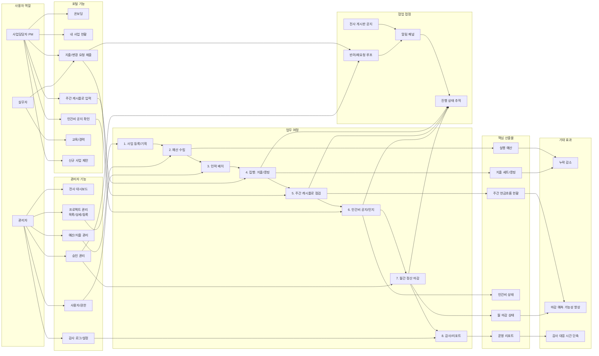

# Business Management Platform - Feature MAP (기능 중심)

아래 다이어그램은 개발 구현체보다 실제 업무 흐름(누가, 언제, 무엇을 처리하는지) 중심으로 정리한 맵입니다.

## 한 줄 요약
- 이 플랫폼은 `사업 등록 → 집행 → 주간 점검 → 인건비 → 월마감 → 감사`를 관리자/PM/실무자가 협업해 끊김 없이 처리하도록 설계되어 있습니다.
